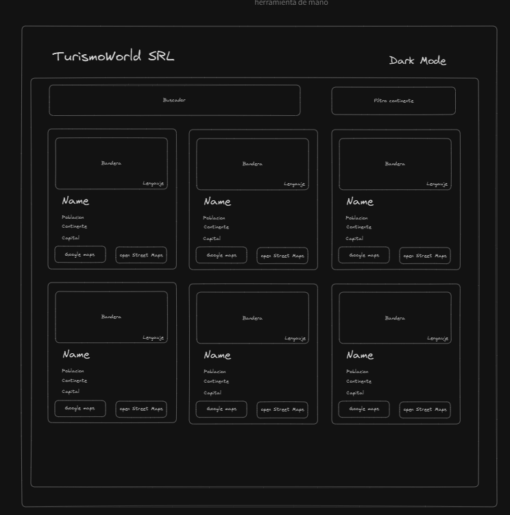
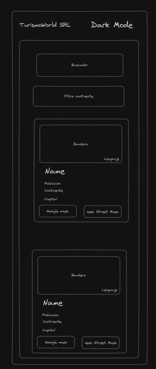

# Prueba tecnica MundoIT - Frontend Developer React

## Instrucciones

Nuestro cliente, una empresa de viajes necesita una web donde ver todos los países del mundo. Para ello, nos han proporcionado una API que nos da la información de todos los países. La API es la siguiente: [RestCountries](https://restcountries.com/). Necesitamos que hagas una web en React que muestre todos los países y que permita filtrar por continente y por nombre de país. Además marcar los países que no son independientes.

## Requisitos

- La web debe estar hecha en React.
- La web debe ser responsive.
- La web debe tener una página principal donde se muestren todos los países.
- La web debe tener un filtro por continente y por nombre de país.
- La web debe marcar los países que no son independientes.

## Extras

- El usuario puede marcar los países como favoritos.
- El usuario puede ver los países favoritos.
- Al recargar la página, los países favoritos no se pierden.

## API

Para obtener la información de los países, se debe hacer una llamada a la siguiente API:

```bash
https://restcountries.com/v3.1/all
```

## Diseño

El diseño es libre, se te dara un diseño base para que puedas guiarte, pero puedes hacerlo a tu gusto.

Ejemplo de mockup:





## Valoramos

- Uso de buenas prácticas
- menor cantidad de llamadas a la API
- menor cantidad de librerias
- Código limpio y ordenado
- Uso de fetch
- Uso de hooks
- Uso de css
- Uso de typescript

## tipos de typescript

```typescript

export interface Countries {
    name:         Name;
    tld?:         string[];
    cca2:         string;
    ccn3?:        string;
    cca3:         string;
    independent?: boolean;
    status:       Status;
    unMember:     boolean;
    currencies?:  { [key: string]: Currency };
    idd:          Idd;
    capital?:     string[];
    altSpellings: string[];
    region:       Region;
    languages?:   { [key: string]: string };
    translations: { [key: string]: Translation };
    latlng:       number[];
    landlocked:   boolean;
    area:         number;
    demonyms?:    Demonyms;
    flag:         string;
    maps:         Maps;
    population:   number;
    car:          Car;
    timezones:    string[];
    continents:   Continent[];
    flags:        Flags;
    coatOfArms:   CoatOfArms;
    startOfWeek:  StartOfWeek;
    capitalInfo:  CapitalInfo;
    cioc?:        string;
    subregion?:   string;
    fifa?:        string;
    borders?:     string[];
    gini?:        { [key: string]: number };
    postalCode?:  PostalCode;
}

export interface CapitalInfo {
    latlng?: number[];
}

export interface Car {
    signs?: string[];
    side:   Side;
}

export type Side = "right" | "left";

export interface CoatOfArms {
    png?: string;
    svg?: string;
}

export type Continent = "Antarctica" | "North America" | "Europe" | "Africa" | "Asia" | "Oceania" | "South America";

export interface Currency {
    name:   string;
    symbol: string;
}

export interface Demonyms {
    eng:  Eng;
    fra?: Eng;
}

export interface Eng {
    f: string;
    m: string;
}

export interface Flags {
    png:  string;
    svg:  string;
    alt?: string;
}

export interface Idd {
    root?:     string;
    suffixes?: string[];
}

export interface Maps {
    googleMaps:     string;
    openStreetMaps: string;
}

export interface Name {
    common:      string;
    official:    string;
    nativeName?: { [key: string]: Translation };
}

export interface Translation {
    official: string;
    common:   string;
}

export interface PostalCode {
    format: string;
    regex?: string;
}

export type Region = "Antarctic" | "Americas" | "Europe" | "Africa" | "Asia" | "Oceania";

export type StartOfWeek = "monday" | "sunday" | "saturday";

export type Status = "officially-assigned" | "user-assigned";

```
